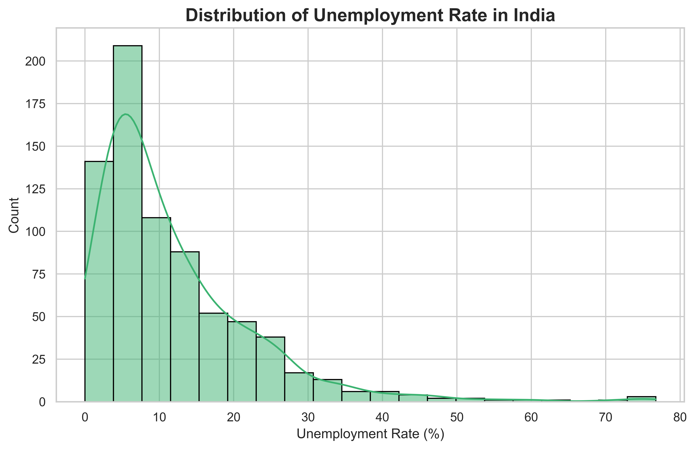
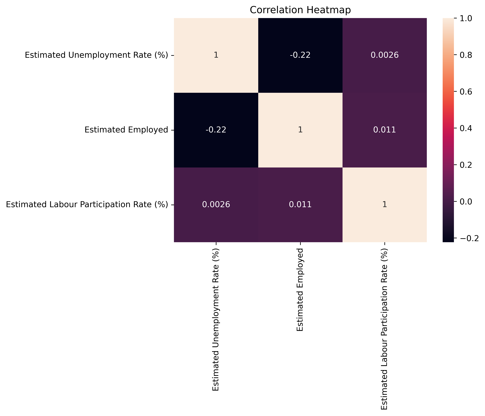
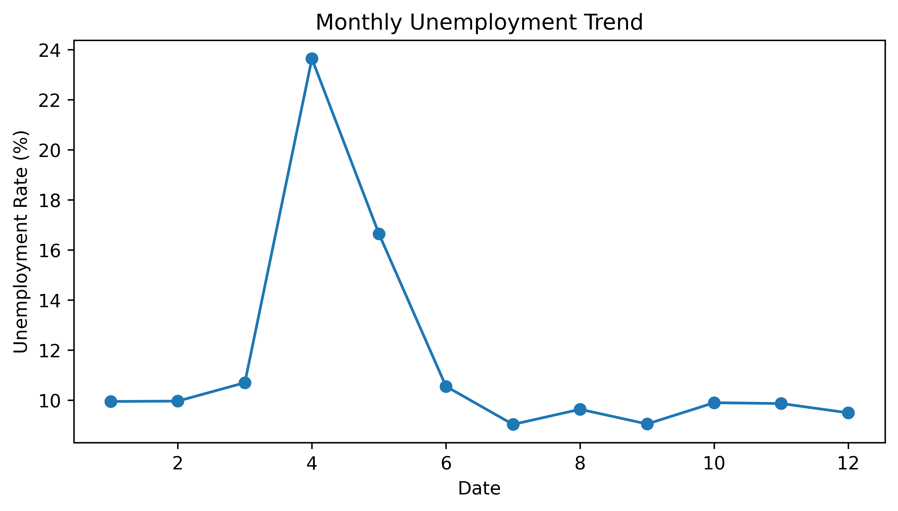
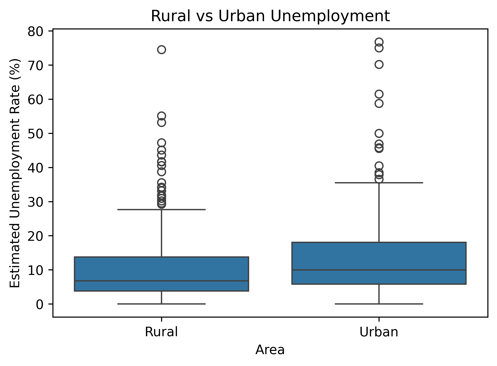
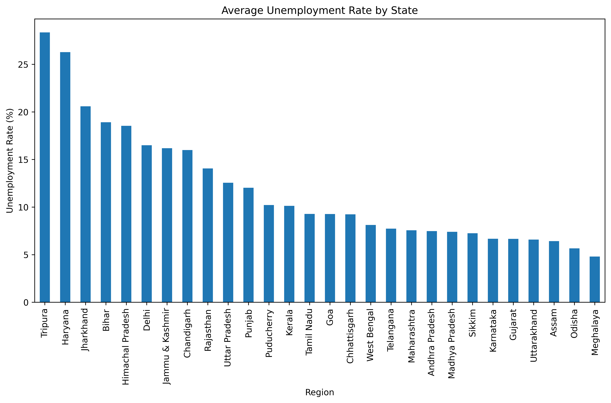
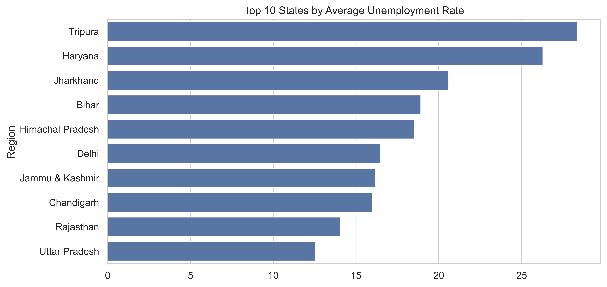

# 📊 Unemployment Analysis in India Using Python

This project was completed as part of the **CodeAlpha Data Science Internship**.

The objective of this project is to analyze unemployment trends in India using Python and data visualization techniques. Through Exploratory Data Analysis (EDA), different patterns and insights related to unemployment across Indian states were identified.

---

## 🎯 Project Objective

The main goal of this project is to:

- Analyze unemployment trends in India
- Compare unemployment across different states
- Study Rural vs Urban unemployment
- Visualize unemployment distribution
- Understand relationships between employment-related factors

---

## 🛠️ Technologies Used

- Python
- Pandas
- NumPy
- Matplotlib
- Seaborn
- Jupyter Notebook

---

## 📂 Dataset Features

The dataset contains the following information:

- Region
- Date
- Frequency
- Estimated Unemployment Rate (%)
- Estimated Employed
- Estimated Labour Participation Rate (%)
- Area (Rural/Urban)

---

## 📈 Visualizations

### 1️⃣ Distribution of Unemployment Rate

This histogram shows how unemployment rates are distributed across India.

---

### 2️⃣ Correlation Heatmap

The heatmap shows the relationship between unemployment rate, employment, and labour participation rate.

---

### 3️⃣ Monthly Unemployment Trend

This visualization highlights how unemployment rates changed over different months.

---

### 4️⃣ Rural vs Urban Unemployment

A comparison of unemployment rates between rural and urban areas.

---

### 5️⃣ State-wise Unemployment Analysis

Average unemployment rates across different Indian states.

---

### 6️⃣ Top 10 States by Average Unemployment Rate

States with the highest average unemployment rates.

---

## 🔍 Key Insights

- Tripura recorded the highest average unemployment rate.
- Haryana and Jharkhand also showed significantly high unemployment rates.
- Urban areas generally experienced higher unemployment compared to rural areas.
- A noticeable spike in unemployment was observed around April.
- Most unemployment rates were concentrated between 3% and 15%.
- Employment and unemployment showed a weak negative correlation.
- Labour Participation Rate had very little correlation with unemployment rate.

---

## 📚 Learning Outcomes

Through this project, I learned:

- Data Cleaning
- Data Preprocessing
- Exploratory Data Analysis (EDA)
- Data Visualization
- Trend Analysis
- Statistical Interpretation
- Working with Real-World Datasets

---

## 🚀 Conclusion

This project analyzed unemployment trends in India using Python and data visualization techniques. By exploring state-wise unemployment rates, rural and urban differences, monthly trends, and feature correlations, meaningful insights were extracted from the dataset.

The analysis revealed that some states experienced significantly higher unemployment rates than others, while urban areas generally showed higher unemployment compared to rural regions. Overall, this project strengthened my skills in data analysis, visualization, and deriving insights from real-world data.

---

## 👨‍💻 Author

**Mamun Reja**

B.Tech (Artificial Intelligence & Machine Learning)

CodeAlpha Data Science Intern

🔗 GitHub: https://github.com/mamuncoder07
